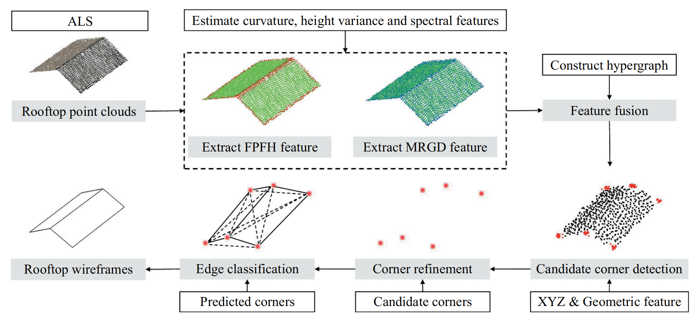
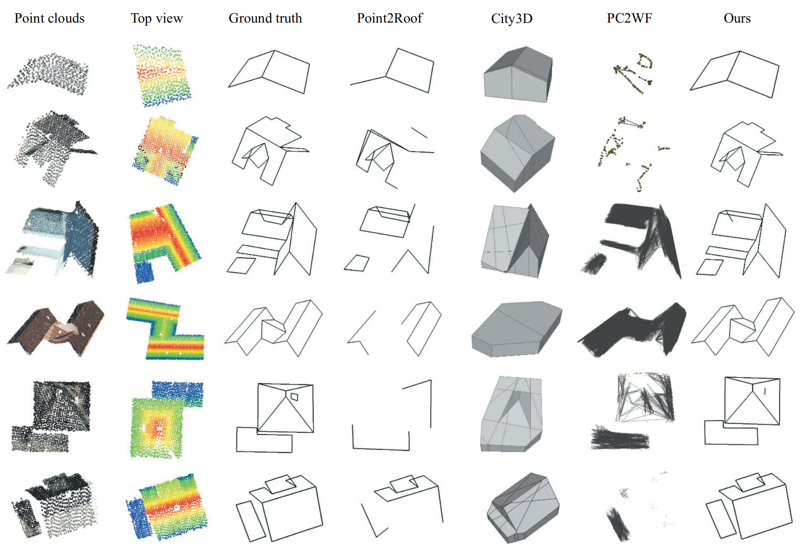
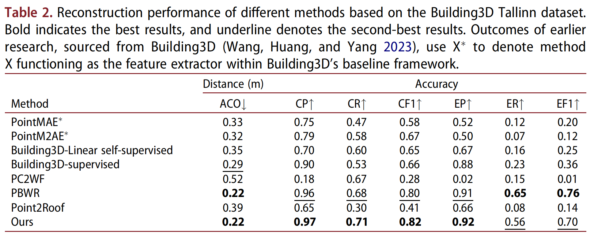
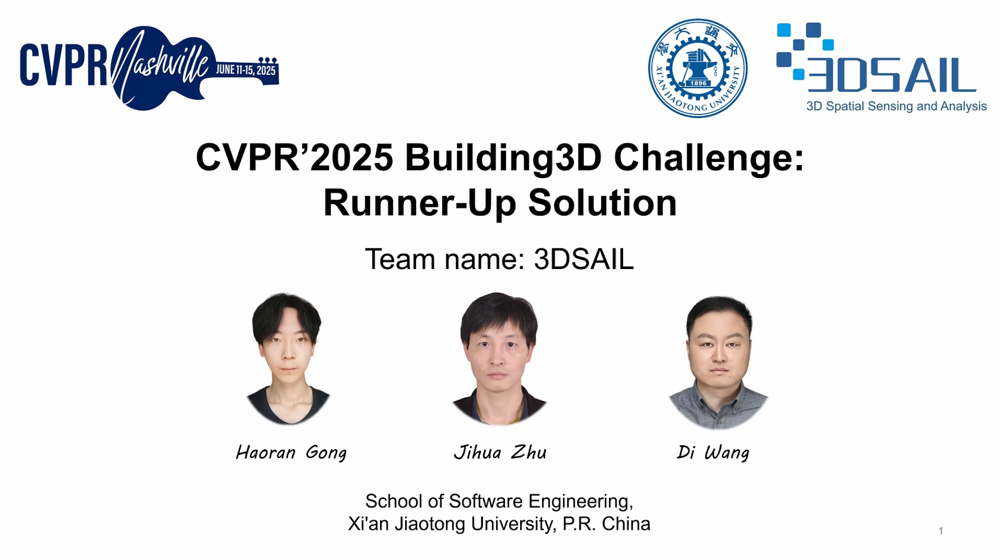

# [IJRS] Robust Building Wireframe Reconstruction: A Hypergraph and Transformer-Enhanced Framework for Large-Scale and Real-World Urban Point Clouds 

Official implementation of
**“Robust Building Wireframe Reconstruction: A Hypergraph and Transformer-Enhanced Framework for Large-Scale and Real-World Urban Point Clouds”** 

🥈 Won 2st place in Building3D Challenge at CVPR2025.


## 📌 Abstract

Accurate 3D building reconstruction is crucial for advancing urban digital twinning, city planning, and sustainable development. As a key architectural component, rooftops facilitate urban energy management and inform urban morphological analysis. Consequently, achieving precise and scalable rooftop reconstruction has emerged as a key research focus in recent years. Point clouds, with their ability to preserve detailed geometric structures, are well suited for this task. However, existing methods predominantly target synthetic rooftop datasets, which lack architectural diversity and often require high-quality point clouds as input. These limitations hinder their applicability to large-scale, real-world urban environments characterized by varied rooftop designs and noisy or sparse data. To address these challenges, we propose a novel end-to-end framework for rooftop wireframe reconstruction from airborne laser scanning (ALS) point clouds. Our approach introduces a multi-scale local feature descriptor optimized for rooftops to enhance per-point geometric feature extraction. Then, a hypergraph-based attention fusion module integrates these features. After comprehensive feature learning by a robust backbone, initial corner detection is followed by a Transformer- and EdgeConv-enhanced edge classification mechanism that models topological relationships through long-range dependencies. Experiments on the large-scale real-world Building3D dataset demonstrate significant improvements over the baseline, with corner accuracy improved by 35% on the Entry-level subset and 41% on the Tallinn subset. Qualitative comparisons further reveal superior wireframe fidelity, underscoring the method’s potential to support digital twinning, urban management, and economic development in smart city initiatives.

---

# 📖 Paper

### International Journal of Remote Sensing 2025

**Robust building wireframe reconstruction: a hypergraph and transformer-enhanced framework for large-scale and real-world urban point clouds**  
Haoran Gong, Jing Liu, Rui Tong, Fuqiang Tian, Di Wang

📄 DOI: [https://doi.org/10.1080/01431161.2025.2583601](https://doi.org/10.1080/01431161.2025.2583601)

---

# ✨ Main Features

* End-to-end rooftop wireframe reconstruction
* Robust to sparse and noisy ALS point clouds
* Supports large-scale real-world urban scenes
* Hypergraph-based geometric feature fusion
* Transformer-enhanced edge reasoning
* Generalizes to unseen cities and datasets

---


# 🏗️ Framework Pipeline

<p align="center">
  
</p>

The overall reconstruction pipeline consists of:

1. **Geometric Feature Extraction**
   * FPFH
   * MRGD
   
2. **Hypergraph Attention Fusion**

   * Fuse handcrafted and learned geometric descriptors

3. **Candidate Corner Detection**

   * PTv3-based point feature extraction
   * Corner classification + offset regression

4. **Corner Refinement**

   * DBSCAN clustering
   * Offset refinement network

5. **Edge Classification**

   * Transformer
   * EdgeConv
   * Paired Point Attention


---

# 📊 Results

Our method achieves state-of-the-art performance on Building3D.

<p align="center">
  
</p>

<p align="center">
  
</p>


---

# 🧩 Installation

## 1. Clone Repository

```bash
git clone https://github.com/ranhaogong/Robust-Building-Wireframe-Reconstruction.git
cd Robust-Building-Wireframe-Reconstruction
```

---

## 2. Create Conda Environment

We provide an `environment.yaml` file for reproducing all experiments.

```bash
conda env create -f environment.yaml
conda activate p2rf
```

---

## 3. Install `pc_util`

Before training or inference, install the custom point cloud utility library:

```bash
cd pc_util
python setup.py install
cd ..
```

---

# 📦 Dependencies

Main dependencies include:

* Python >= 3.8
* PyTorch >= 1.8
* CUDA >= 11.3
* Open3D
* NumPy
* SciPy
* scikit-learn
* tqdm
* PyYAML

If some packages are missing, install them according to compilation/runtime errors.

---

# 📁 Dataset Preparation

## Building3D Dataset

Expected structure:

```text
data/
├── Building3d_tallinn/
├── Building3d_tokyo/
└── ...
```

Processed datasets: https://pan.baidu.com/s/1LLhBVh-bNSnFjIUJBuGOBQ?pwd=287q

---

# 📂 Checkpoints

Pretrained checkpoints: https://pan.baidu.com/s/14KCa19ymzYmMbJV_XiRroQ?pwd=pfpe

| Dataset | Checkpoint                 |
| ------- | -------------------------- |
| Tallinn | `checkpoint_epoch_138.pth` |
| Tokyo   | `checkpoint_epoch_139.pth` |

---

# 🚀 Reproducing Results

## 1. Tallinn Dataset

### Step 1: Create Output Directory

```bash
mkdir -p output/building3d_tallinn/ckpt
```

---

### Step 2: Download Pretrained Weights

Place the checkpoint here:

```text
output/building3d_tallinn/ckpt/checkpoint_epoch_138.pth
```

---

### Step 3: Select Correct Model Version

```bash
cd model
cp pointnet2_cross_attention.py pointnet2.py
cd ..
```

---

### Step 4: Run Inference

```bash
cd script

CUDA_VISIBLE_DEVICES=0 \
python ../test_save_building3d.py \
    --data_path ../data/Building3d_tallinn \
    --cfg_file ../cfg/model_cfg_color_fpfh_lovasz_2048_dbscan_003_cross_attention.yaml \
    --test_tag building3d_tallinn \
    --batch_size 64
```

---

## 2. Tokyo Dataset

### Step 1: Pre-segment Tokyo Dataset

Modify the input/output path in:

```text
segment_label.py
```

Then run:

```bash
python segment_label.py
```

---

### Step 2: Create Output Directory

```bash
mkdir -p output/building3d_tokyo/ckpt
```

---

### Step 3: Download Pretrained Weights

Place the checkpoint here:

```text
output/building3d_tokyo/ckpt/checkpoint_epoch_139.pth
```

---

### Step 4: Select Correct Model Version

```bash
cd model
cp pointnet2_ptv3_lovasz.py pointnet2.py
cd ..
```

---

### Step 5: Modify Edge Threshold

> not necessary, it's a trick and it's dataset-sensitive, the improvement is marginal

Edit:

```text
test_util.py
```

Change line 126:

```python
match_edge = all_edges[edge_pred[idx:idx + len(all_edges)] > 0.5]
```

to:

```python
match_edge = all_edges[edge_pred[idx:idx + len(all_edges)] > 0.6]
```

---

### Step 6: Run Inference

```bash
cd script

CUDA_VISIBLE_DEVICES=0 \
python ../test_save_building3d.py \
    --data_path ../data/Building3d_tokyo \
    --cfg_file ../cfg/model_cfg_color_mrgd_lovasz_2048_dbscan_003.yaml \
    --test_tag building3d_tokyo \
    --batch_size 16
```

---

### Step 7: Merge Results

Modify paths in:

```text
tokyo_output_merge.py
```

Then run:

```bash
python tokyo_output_merge.py
```

---

# 🏋️ Training

```bash
cd script

CUDA_VISIBLE_DEVICES=0 \
python ../train_building3d.py \
--data_path ../data/Building3d_tallinn \
--cfg_file ../cfg/model_cfg_color_fpfh_lovasz_2048_dbscan_003_cross_attention.yaml \
--batch_size 64 \
--extra_tag building3d_all_ptv3_color_2048_adamw_cosine_lr4_epoch150_fpfh_lovasz_edge_dbscan_003_cross_attention \
--epochs 150 \
--lr 1e-3
```

---


# 📈 Evaluation Metrics

We follow the official Building3D evaluation protocol:

* ACO
* CP / CR / CF1
* EP / ER / EF1

Refer to official evaluation platform: https://huggingface.co/spaces/Building3D/Building3DTallinnDatasetEvaluationPlatform

---

# Invited Talk
[](https://www.bilibili.com/video/BV162LP6HEXK/?spm_id_from=333.1387.upload.video_card.click&vd_source=48118c7a80f2b975b629d1c983c73ad0)

---

# 📝 Citation

```bibtex
@article{gong2025robust,
  title={Robust building wireframe reconstruction: a hypergraph and transformer-enhanced framework for large-scale and real-world urban point clouds},
  author={Gong, Haoran and Liu, Jing and Tong, Rui and Tian, Fuqiang and Wang, Di},
  journal={International Journal of Remote Sensing},
  volume={46},
  number={24},
  pages={9565--9596},
  year={2025},
  publisher={Taylor \& Francis}
}
```

---

# 🙏 Acknowledgements

This work is built upon several excellent open-source projects:

* [PointNet++](https://github.com/charlesq34/pointnet2)
* [Point Transformer v3](https://github.com/pointcept/pointtransformerv3)
* [Point2Roof](https://github.com/Li-Li-Whu/Point2Roof)

We sincerely thank the authors for their contributions.

---

# 📬 Contact

[Haoran Gong](https://ranhaogong.github.io/)
Xi’an Jiaotong University

📧 Email: <gonghr@stu.xjtu.edu.cn>

If you find this work useful, please consider giving a ⭐ to the repository.
